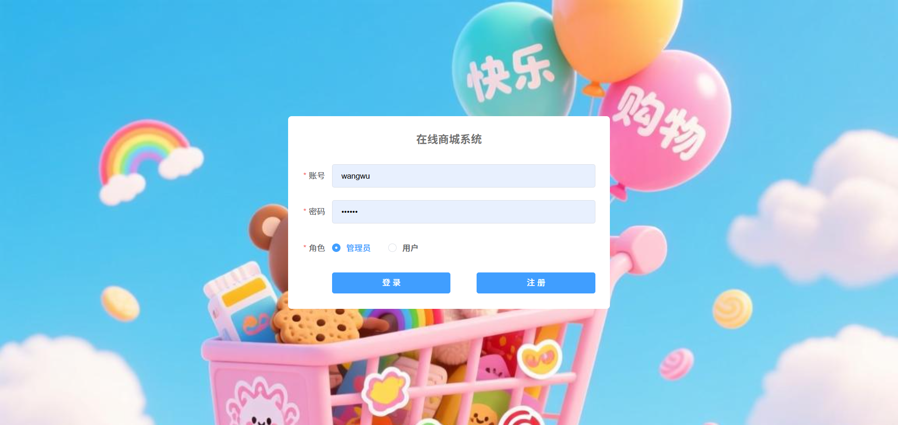
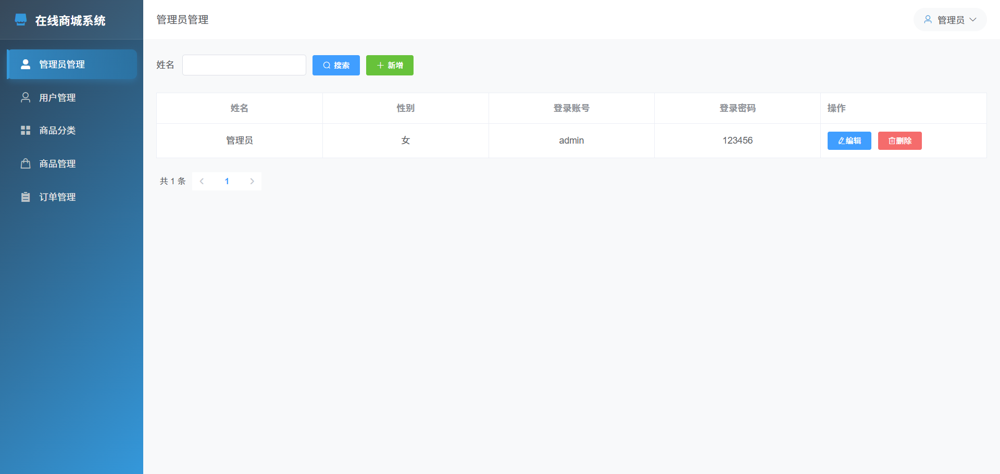
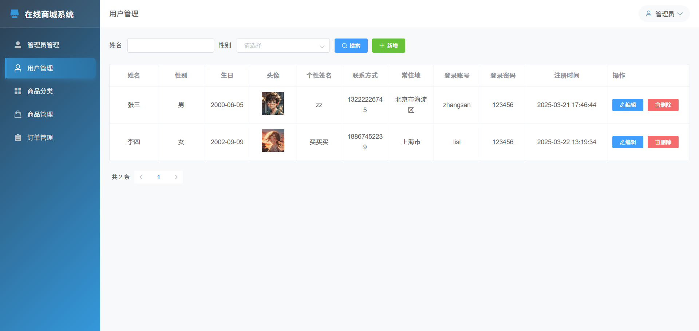
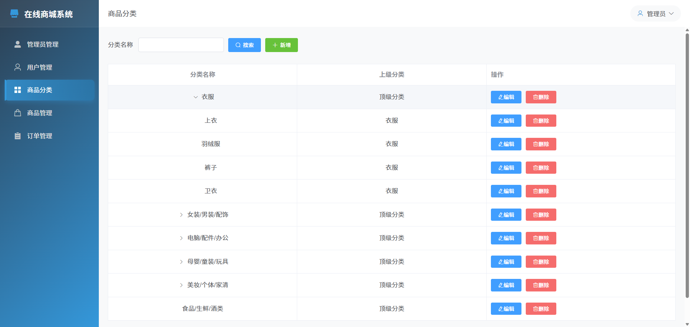
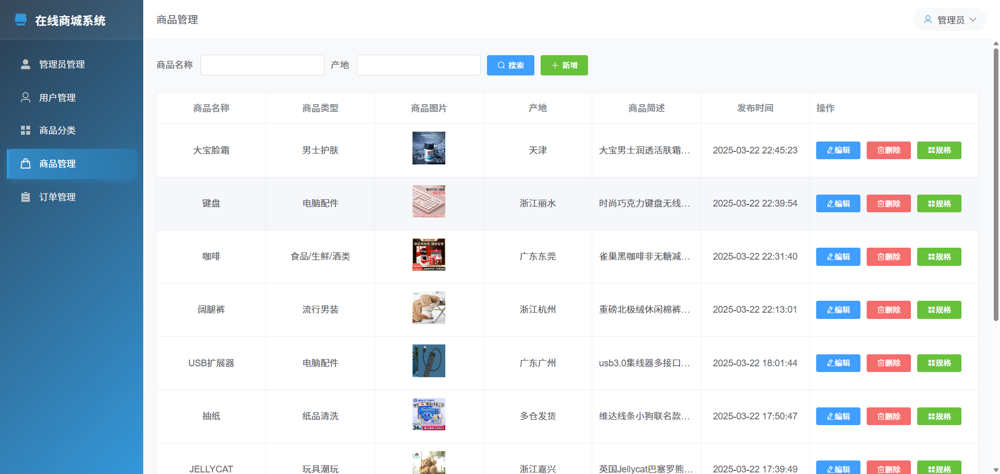
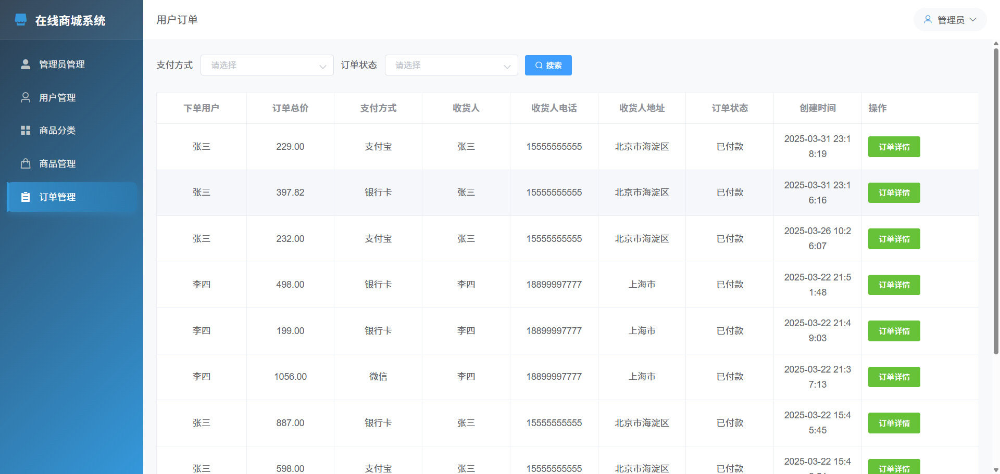
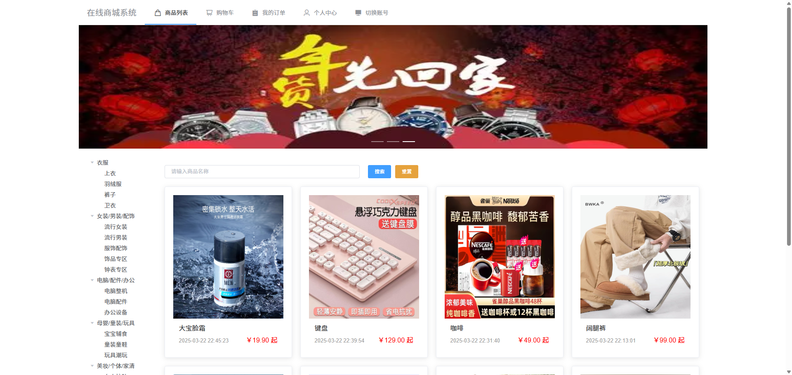
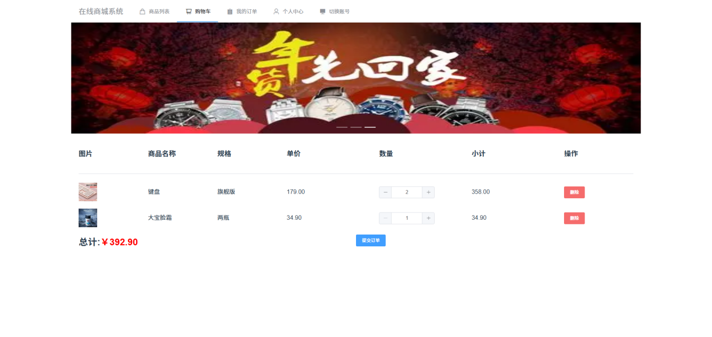

# 项目介绍
计算机毕业项目，电子商城系统，SpringBoot+Vue
包含前后端代码、开TI报告模板、答辩ppt、万字文档
# 需要源码和文档请联系
V：bishe688
# 功能详情：
## 登录注册
系统用户分为两类，管理员和普通用户，管理员通过别的管理员添加到系统。用户通过管理员添加到系统或注册到系统。注册信息包括姓名、头像、个性签名、性别、生日、联系电话、常住地、登录账号、登录密码。

## 管理端功能设计
管理员管理：管理别的管理员信息，包括姓名、性别、登录账号、登录密码。

用户管理：管理用户信息，包括姓名、性别、出生日期、头像等。

商品分类管理：管理员可以管理商品分类，包括分类名称、上级分类。

商品管理：管理员可以管理商品信息，包括商品名称、商品分类、品牌、商品图片、商品描述、商品规格(规格名称、价格、库存量)

订单管理：查看订单信息。

## 用户端功能设计
查看商品列表：用户可以查看商品列表，根据分类、名称。

商品详情：用户可以查看商品详情信息，在详情页可以把商品加入到购物车。

购物车：用户可以查看购物车列表商品，包括商品名称、商品规格、购买数量。可以进行加减后买商品量

提交订单：用户在购物车页面可以提交订单跳转到支付页，选择微信/支付宝/银行卡进行支付。

我的订单：用户可以查看自己的订单列表。

个人中心：用户可以管理自己的个人信息。

# 材料列表

# 万字文档

# 需要源码和文档请联系
V：bishe688
