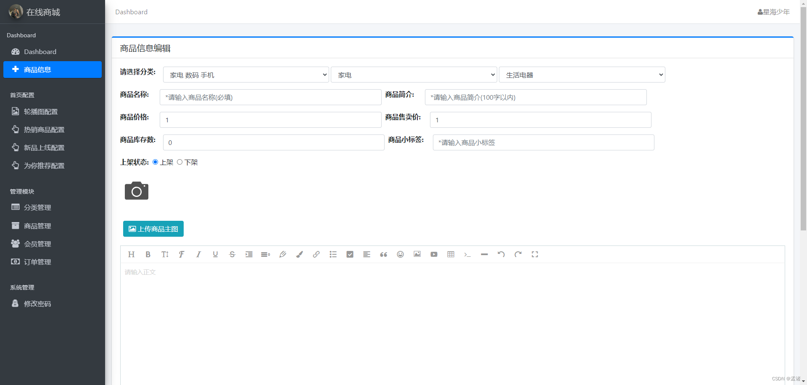
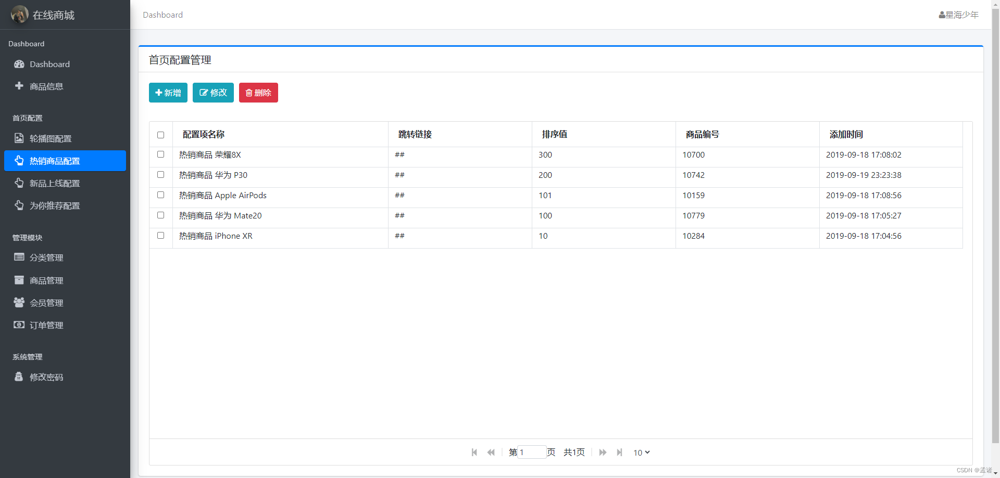
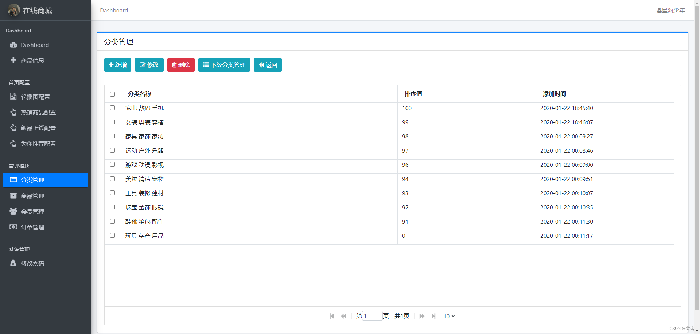
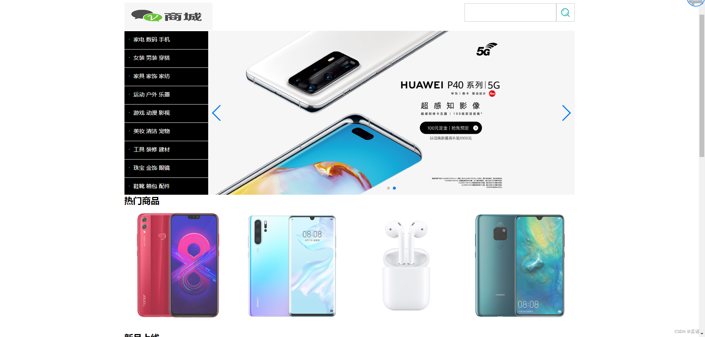
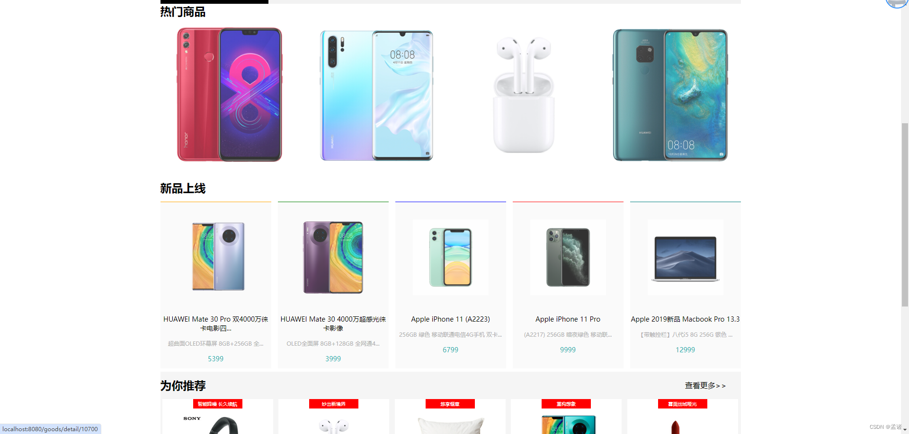
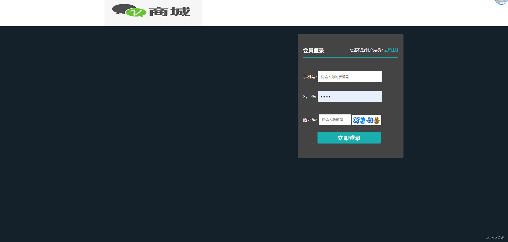
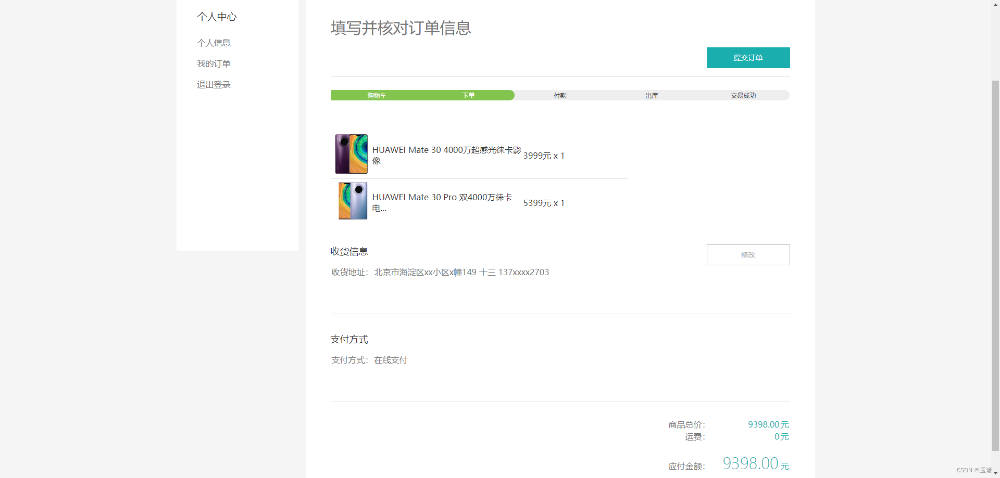

# 项目介绍
计算机毕业项目，电子商城系统，SpringBoot+Vue
包含前后端代码、开TI报告模板、答辩ppt、设计文档（查重30%以下）
# 功能详情：
## 登录注册
 - 系统用户分为两类，管理员和普通用户，管理员通过别的管理员添加到系统。用户通过管理员添加到系统或注册到系统。注册信息包括姓名、头像、个性签名、性别、生日、联系电话、常住地、登录账号、登录密码。
   
## 管理端功能设计
- 用户管理：管理用户信息
  
- 管理员管理：管理管理员信息
  
- 商品分类管理：管理员可以管理商品分类，包括分类名称、上级分类。
  
- 商品管理：管理员可以管理商品信息，包括商品名称、商品分类、品牌、商品图片、商品描述、商品规格(规格名称、价格、库存量)
  
- 订单管理：管理员查看订单信息，安排发货收货。
  
- 评价管理：管理员查看评价信息，对违规的评价可以删除。
  
- 数据统计：管理员可以查看数据统计，包括注册用户数、商品个数、订单个数、累计成交额、近30天销售趋势图、商品销量排行榜top5、商品销量统计、商品销售金额统计。
  
  
## 用户端功能设计
- 查看商品列表：用户可以查看商品列表，根据分类、名称、品牌进行搜索。同时可以查看推荐商品，推荐商品是指商品评分排名前五名的商品。
  
- 商品详情：用户可以查看商品详情信息，在详情页可以把商品加入到购物车。
  
- 购物车：用户可以查看购物车列表商品，包括商品名称、商品规格、购买数量。可以进行加减后买商品量
  
- 提交订单：用户在购物车页面可以提交订单跳转到支付页，选择微信/支付宝/银行卡输入密码。
  
- 我的订单：用户可以查看自己的订单列表，包括全部、待支付、待发货、待收货、待评价。
  
- 个人中心：用户可以管理自己的个人信息、支付设置、收货地址列表。
  

# 材料列表

# 万字文档

# 查重报告

# 需要源码和数据库请联系
V：bishe688
