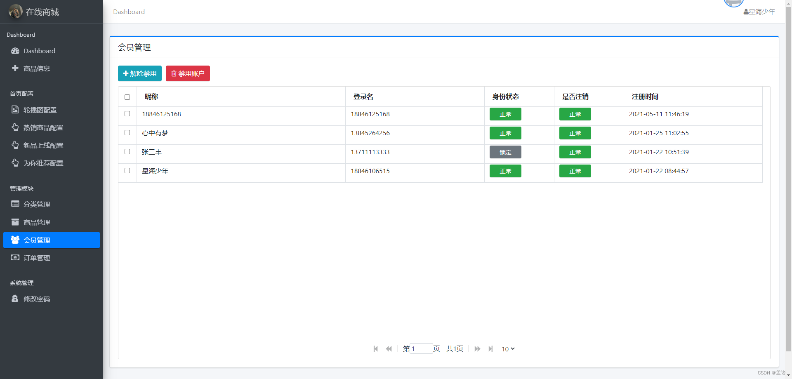
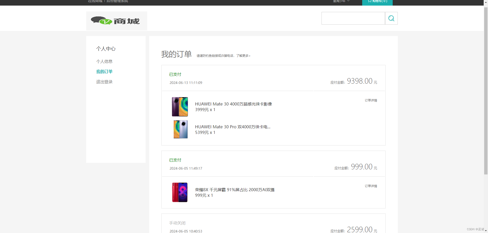

# 1 项目介绍
在线商城系统，后端java语言，springboot，SSM框架。前端thymeleaf，前后端不分离。本项目已经隐去作者信息，所有代码文件均没有创建人和创建时间，可以放心使用。
系统用户分为两类，管理员和普通用户。
管理员功能：
- 基本功能：登录、修改个人信息、修改密码
- 轮播图管理
- 热销商品管理
- 新品上线管理
- 推荐商品管理
- 商品分类管理：支持三级商品分类
- 商品管理：商品上架下架、编辑、支持富文本描述
- 会员管理：解除/禁用账户
- 订单管理：修改订单、配货、出库、关闭订单。关闭订单会恢复商品库存
  用户功能：
- 基本功能：登录注册、修改个人信息
- 首页面：商品分类、轮播图、热门商品、新品、推荐商品
- 查看商品详情、加入购物车
- 订单管理：查看历史订单、下单、订单支付(微信、支付宝、银行卡模拟支付)、确认收货。
# 2 系统运行截图
## 2.1 管理端
### 2.1.1 用户登录

### 2.1.2 录入商品
录入商品基本信息，富文本编辑器录入商品详情

### 2.1.3 轮播图管理

### 2.1.3 热销商品配置

### 2.1.4 新品上线配置

### 2.1.5 推荐商品配置

### 2.1.6 商品分类配置

### 2.1.7 商品管理

### 2.1.8 会员管理

### 2.1.9 订单管理

### 2.1.10 修改个人信息

## 2.2 用户端
### 2.2.1 网站首页

### 2.2.2 用户登录

### 2.2.3 商品详情

### 2.2.4 购物车

### 2.2.5 提交订单

### 2.2.6 订单支付

### 2.2.7 查看订单列表

### 2.2.8 个人信息维护

# 3 数据库

# 4 项目文档

# 5 需要源码和数据库请联系

